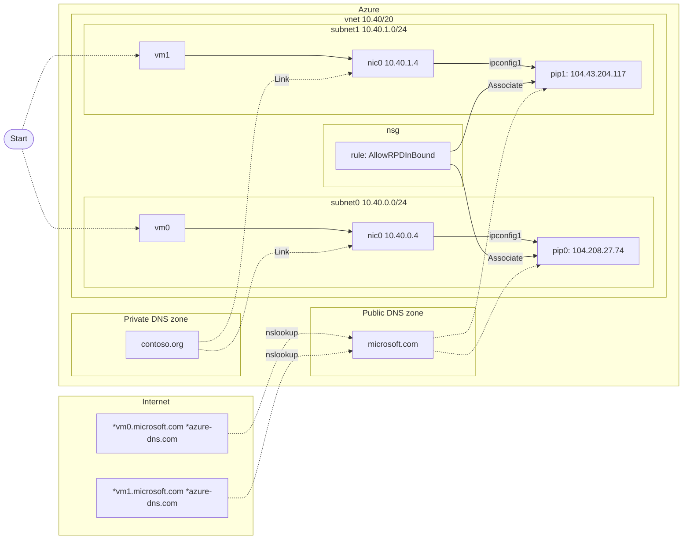

[Reference](https://microsoftlearning.github.io/AZ-104-MicrosoftAzureAdministrator/Instructions/Labs/LAB_04-Implement_Virtual_Networking.html)

```mermaid
graph LR

start([Start])
start -.-> vm0
start -.-> vm1

subgraph Azure

    subgraph vnet 10.40/20
        subgraph subnet0 10.40.0.0/24
            vm0 --> nic0[nic0 10.40.0.4]
            nic0 -->|ipconfig1| pip0[pip0: 104.208.27.74]
        end

        subgraph subnet1 10.40.1.0/24
            vm1 --> nic1[nic0 10.40.1.4]
            nic1 -->|ipconfig1| pip1[pip1: 104.43.204.117]
        end

        subgraph nsg
            rule[rule: AllowRPDInBound]
            rule -->|Associate| pip0
            rule -->|Associate| pip1
        end
    end

    subgraph Private DNS zone
        privateEndpoint[contoso.org] -.->|Link| nic0
        privateEndpoint -.->|Link| nic1
    end

    subgraph Public DNS zone
        publicEndpoint[microsoft.com] 
        publicEndpoint -.-> pip0
        publicEndpoint -.-> pip1
    end

end


subgraph Internet
    nslookup0[*vm0.microsoft.com *azure-dns.com] -.->|nslookup| publicEndpoint
    nslookup1[*vm1.microsoft.com *azure-dns.com] -.->|nslookup| publicEndpoint
end

```
